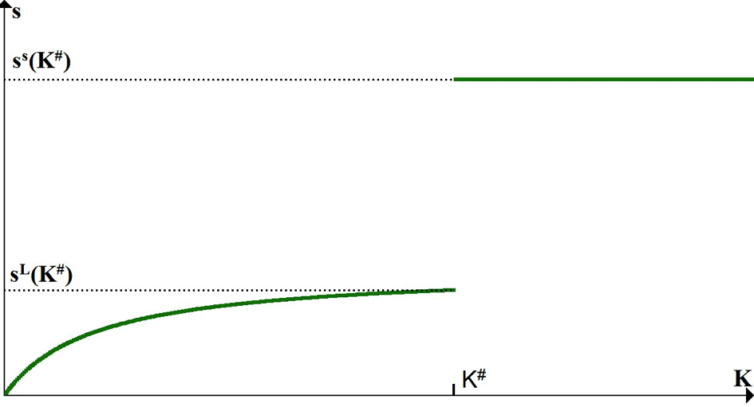
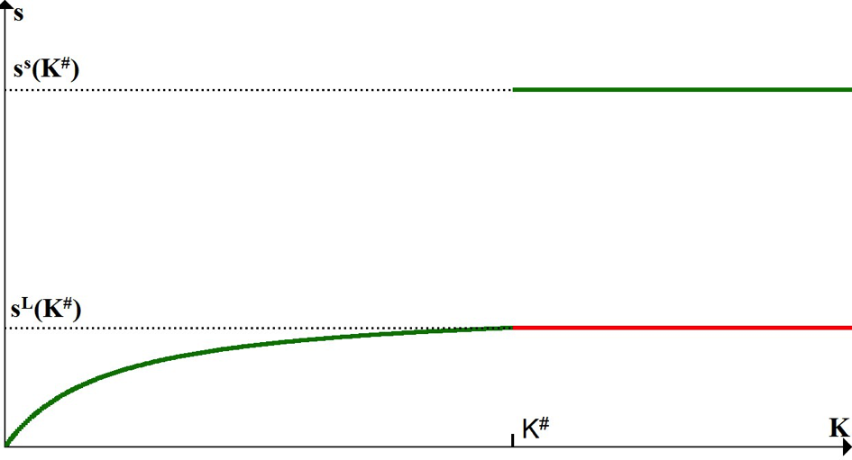

% Assignment Lewis
% Tim Schrama
% TiSEM, Tilburg University

Introduction
================

First steps
----------
Preparation: derivation of the Lewis model.
Before we turn to the main questions of the assignment, we first build up the Lewis model. We will derive the most important equations for reference later on. Start by writing down the seven formulas that form blueprint of the Lewis design:

Formulas
--------

\begin{align}
Y_S=A_S L_S \\
w_S=A_S\\
Y_M=A_M K^\alpha L_M ^{1-\alpha}\\
w_M=[1-\alpha]\frac{Y_M}{L_M}\\
L=L_M+L_S\\
w_M=\phi w_S\\
\dot{K}= s_\pi [Y_M-w_M L_M ]-\delta K
\end{align}

Final results
=================

Growth of economy
-----------

\begin{align}
\dot{Y}=\dot{K} A_S (\frac{\phi}{1-\alpha}-1)\frac{(1-\alpha) A_M}{\phi A_S}^{\frac{1}{\alpha}} \nonumber \\
\rightarrow \hat{Y} =\frac{\dot{K} A_S (\frac{\phi}{1-\alpha}-1)\frac{(1-\alpha)A_M}{\phi A_S}^{\frac{1}{\alpha}}}{Y} \nonumber \\
\rightarrow \hat{Y} =\dot{K} A_S \frac{(\frac{\phi}{1-\alpha}-1)(\frac{1-\alpha}{\phi} \frac{A_M}{A_S} )^{\frac{1}{\alpha}}}{A_S L+K A_S (\frac{\phi}{1-\alpha}-1)(\frac{1-\alpha}{\phi} \frac{A_M}{A_S} )^{\frac{1}{\alpha}}} \nonumber \\
\end{align}

-------

\begin{align}
\rightarrow \hat{Y} =\hat{K} A_S \frac{(\frac{\phi}{1-\alpha}-1)(\frac{(1-\alpha)}{\phi}  \frac{A_M}{A_S} )^{\frac{1}{\alpha}}}{\frac{A_S L}{K}+A_S (\frac{\phi}{1-\alpha}-1)(\frac{(1-\alpha)}{\phi}  \frac{A_M}{A_S})^{\frac{1}{\alpha}}} \nonumber \\
\rightarrow \hat{Y} =\hat{K} A_S \frac{(\frac{\phi}{1-\alpha}-1)(\frac{1-\alpha}{\phi}  \frac{A_M}{A_S}) ^{\frac{1}{\alpha}}+\frac{A_S L}{K}-\frac{A_S L}{K}}{\frac{A_S L}{K}+A_S (\frac{\phi}{1-\alpha}-1)(\frac{1-\alpha}{\phi}  \frac{A_M}{A_S})^{\frac{1}{\alpha}}} \nonumber \\
\rightarrow \hat{Y} =\hat{K} (1-\frac{A_S L}{A_S L+K A_S (\frac{\phi}{1-\alpha}-1)(\frac{1-\alpha}{\phi}  \frac{A_M}{A_S})^{\frac{1}{\alpha}}} \nonumber \\
= \hat{K} [1- A_S \frac{L}{Y}]
\end{align}

Over time $A_S$ $L/Y$ becomes smaller, leading to an increasing growth rate of income.

Figure 1
---------

Figure 2
--------

Conclusion
=============

Conclusion
---------------

- I have learned how to use formulas in fancy presentations
- The same holds for figures
- I could make this presentation longer with copy pasting, but that seems useless
